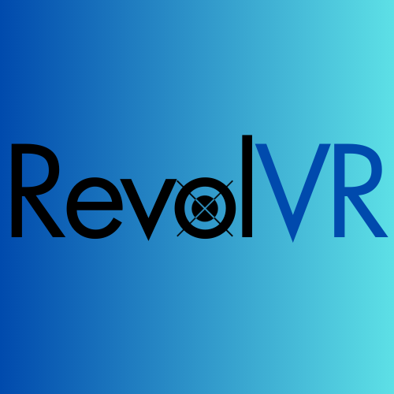

# *A VR-focused Game Engine*

## Table of Contents
* [Overview](#overview)
* [Primary Goals](#primary-goals)
* [Current features](#current-features)
* [Target Hardware](#target-hardware)
* [Planned Features](#planned-features)
* [Contributing](#contributing)
* [Dependencies](#dependencies)
* [Getting Started ](#planned-or-available-features)

## Overview
The RevolVR Game Engine is a VR-focused C++ game engine. It's free to use with a permissive license. The target audience is the tinkerer, or the person interested in making games from scratch.

## Primary Goals
* To make a purpose built games/apps for Meta Quest, Android, or other mobile headsets
* Give people in the native android / XR development community examples from scratch
* Permissive license to encourage modification (regardless of contributions)

## Current features
* CMake build system
* OpenXR compatibility
* Vulkan compatibility
* An Entity Component System (ECS)
* A custom scene description file format
* WAV file loading and playback
* Spatial audio (using OVRAudio)
* Controller input
* Hand tracking
* Keyboard input
* Basic collsion
* Ritual System (Begin(), Update(), & other callbacks)

## Target Hardware
Currently RevolVR only supports, and has been tested on the Meta Quest 1/2. It may work on the Meta Quest Pro and/or Meta Quest 3, but has not been tested on those devices yet.

We hope to expand this in the future. Perhaps starting with lower hanging fruit first (Pico?), and then moving towards other types of headsets (PC VR?).

> **_NOTE:_** While utilizing OpenXR makes cross-platform easier, it still requires work to support various platforms. PC/Desktop VR is not our current focus.

## Planned Features
RevolVR was made with purpose-built in mind. So by-definition it doesn't try to be a general purpose engine. If the game needs it, then the feature gets added. This means no GUI/editor, you will just be editing a scene description file, and writing C++.

With that said, the next major features will be mainly graphical. We plan to use gltf as the graphics file format.

If there is a feature you are particularly interested in, then you may open an issue, or perhaps fork the project and build it yourself.

## Contributing
We are open to our community suggestions and contributions. Here are a few examples of contributions:

Example 1) suppose you have another mobile headset (let's say the Pico). If you can get the input working and have it build correctly with RevolVR then that would be great. We'd love the ability to support more headsets.

Example 2) You find a bug.

Example 3) You want support for other game-related features (more robust collisions or physics)

## Dependencies
* General
  * C++ 17
  * CMake 3.22.1
  * glm
* Platform specific
  * Meta (OpenXR loader, OVRAudio for spatial audio)
  * gradle 7.3.1

## Getting Started

This repo contains only the headers, src, and third party libraries for building. If you are looking to get started with examples, see the [sample project](https://github.com/satchelfrost/revolvr-sample-project.git).